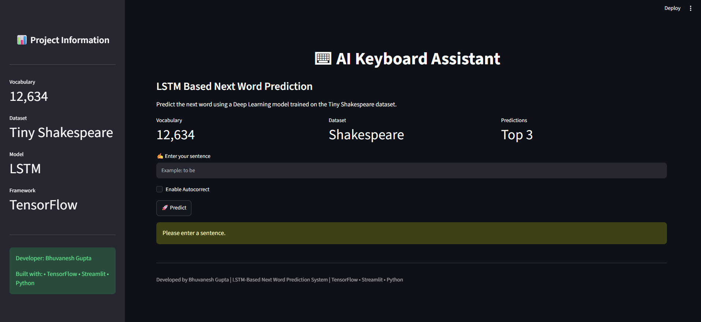
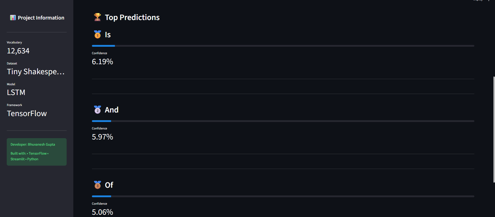
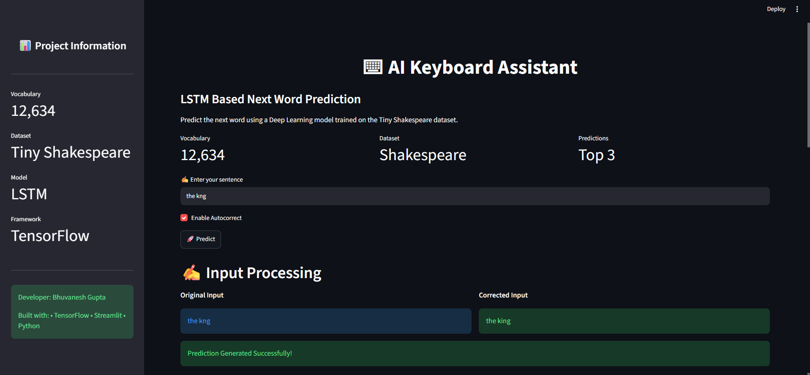
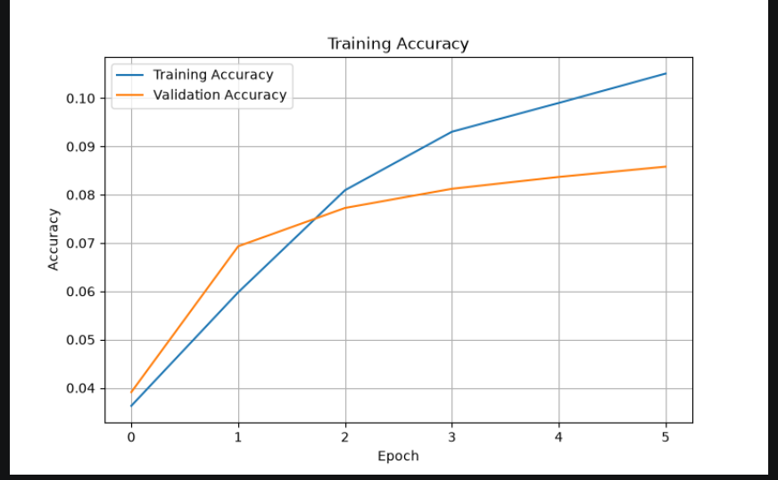
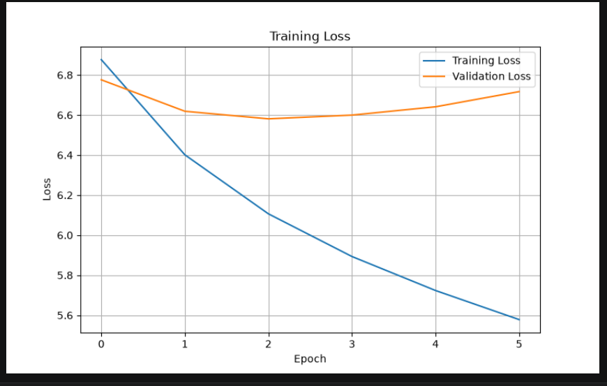

# ⌨ AI Keyboard Assistant: LSTM-Based Next Word Prediction with Autocorrect


---

## 📌 Project Overview

The **AI Keyboard Assistant** is a Deep Learning-based Natural Language Processing (NLP) application that predicts the **next word** in a sentence using an **LSTM (Long Short-Term Memory)** neural network.

The application also includes an optional **Autocorrect** feature that corrects spelling mistakes before generating predictions, providing a more intuitive typing experience.

The model is trained on the **Tiny Shakespeare Dataset** and deployed using an interactive **Streamlit** web application.

---

## ✨ Features

- 🔤 LSTM-based Next Word Prediction
- ✍️ Optional Autocorrect using TextBlob
- 🎯 Top-3 Word Predictions
- 📊 Confidence Scores
- 📈 Training Accuracy & Loss Visualization
- 🌐 Interactive Streamlit Web Application
- 💾 Saved Model and Tokenizer
- ⚡ Real-Time Prediction

---

## 🛠 Technologies Used

| Category | Technology |
|----------|------------|
| Programming Language | Python |
| Deep Learning | TensorFlow / Keras |
| NLP | TextBlob |
| Frontend | Streamlit |
| Data Processing | NumPy |
| Visualization | Matplotlib |
| Dataset | Tiny Shakespeare |

---

## 📂 Project Structure

```text
Task-1
│
├── app/
│   ├── helper.py
│   └── streamlit_app.py
│
├── data/
│   ├── raw/
│   └── processed/
│
├── models/
│   ├── config.json
│   ├── next_word_model.keras
│   └── tokenizer.pkl
│
├── outputs/
│   ├── accuracy.png
│   └── loss.png
│
├── reports/
│
├── src/
│   ├── autocorrect.py
│   ├── config.py
│   ├── data_preparation.py
│   ├── dataset_loader.py
│   ├── evaluate.py
│   ├── model.py
│   ├── predict.py
│   ├── preprocessing.py
│   ├── tokenizer_utils.py
│   ├── train.py
│   └── utils.py
│
├── tests/
│
├── README.md
├── requirements.txt
├── .gitignore
└── main.py
```

---

## 🧠 Model Architecture

The application uses the following Deep Learning architecture:

```text
Input Layer
      │
      ▼
Embedding Layer
      │
      ▼
LSTM Layer
      │
      ▼
Dropout Layer
      │
      ▼
Dense Layer (ReLU)
      │
      ▼
Output Layer (Softmax)
```

---

## 📊 Dataset

- **Dataset:** Tiny Shakespeare
- Contains thousands of Shakespearean sentences used to train an LSTM language model.
- Used for learning contextual relationships between words.

---

## ⚙️ Installation

### 1. Clone the repository

```bash
git clone https://github.com/B2906/ShadowFox.git
```

### 2. Navigate to Task-1

```bash
cd ShadowFox/Task-1
```

### 3. Create a Virtual Environment

```bash
python -m venv venv
```

### 4. Activate the Virtual Environment

**Windows**

```bash
venv\Scripts\activate
```

### 5. Install Dependencies

```bash
pip install -r requirements.txt
```

### 6. Run the Application

```bash
streamlit run app/streamlit_app.py
```

---

## 🚀 How It Works

```text
User Input
      │
      ▼
(Optional) Autocorrect
      │
      ▼
Text Preprocessing
      │
      ▼
Tokenization
      │
      ▼
Sequence Padding
      │
      ▼
LSTM Neural Network
      │
      ▼
Top-3 Next Word Prediction
      │
      ▼
Display Results
```

---

## 📈 Results

The trained LSTM model successfully predicts the most probable next word based on the contextual information provided by the input sentence.

### Example

**Input**

```text
to be
```

**Predicted Word**

```text
the
```

The application also displays the **Top-3 predictions** along with their confidence scores.

---

## 📷 Screenshots

## 🏠 Home Page

The landing page of the AI Keyboard Assistant where users can enter text and receive intelligent next-word predictions.



## 🔮 Next Word Prediction

The model predicts the most probable next word based on the user’s input sequence.



## ✍️ Autocorrect Feature

The application automatically suggests corrected words for misspelled input, improving typing accuracy.



## 📈 Training Accuracy

Training accuracy over multiple epochs, demonstrating the model's learning progress.



## 📉 Training Loss

Training loss decreases over time, indicating effective optimization during model training.



---

## 🔮 Future Scope

- 🤖 Transformer-based Language Models (BERT, GPT)
- 🌍 Multi-language Support
- 🎤 Voice-based Input
- 📱 Mobile Keyboard Integration
- 🧠 Personalized Word Suggestions
- ☁️ Cloud Deployment

---

## 👨‍💻 Developer

**Bhuvanesh Gupta**

Machine Learning & Deep Learning Enthusiast

**GitHub:**  
https://github.com/B2906

---

## 📜 License

This project was developed as part of the **ShadowFox Machine Learning Internship** for educational purposes.
