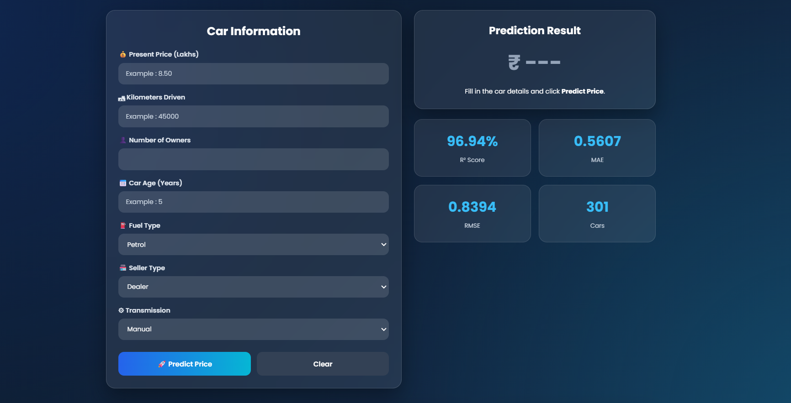
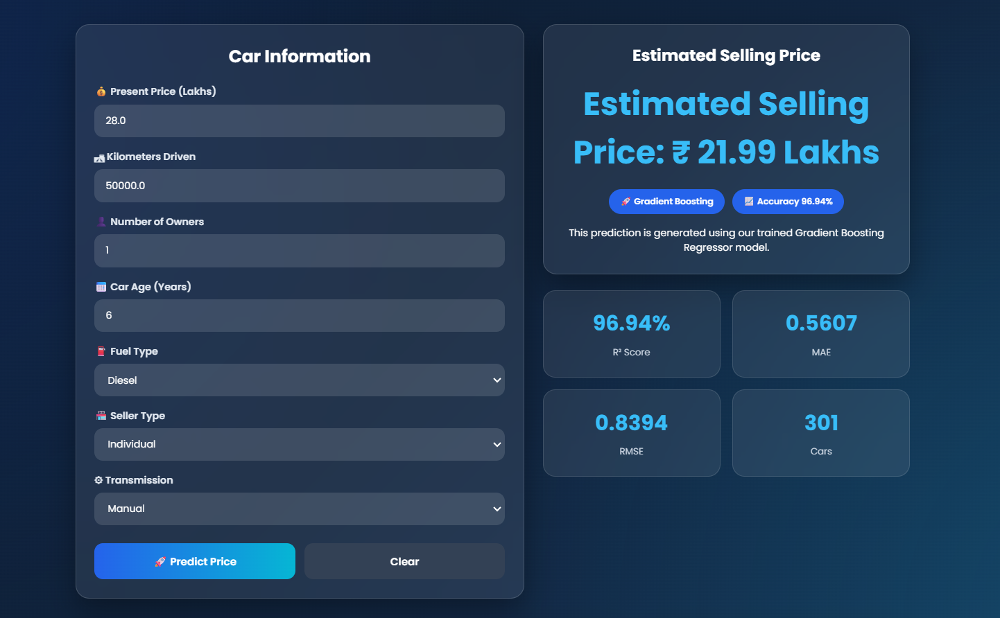
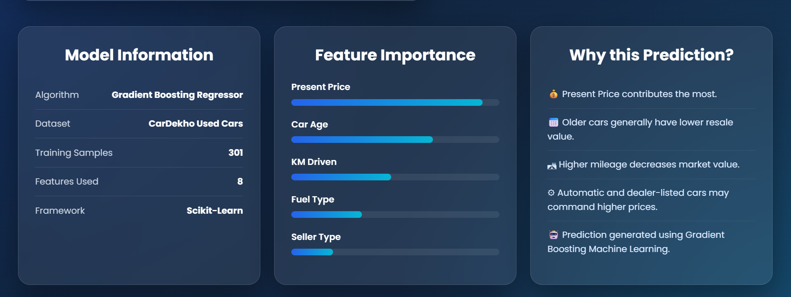
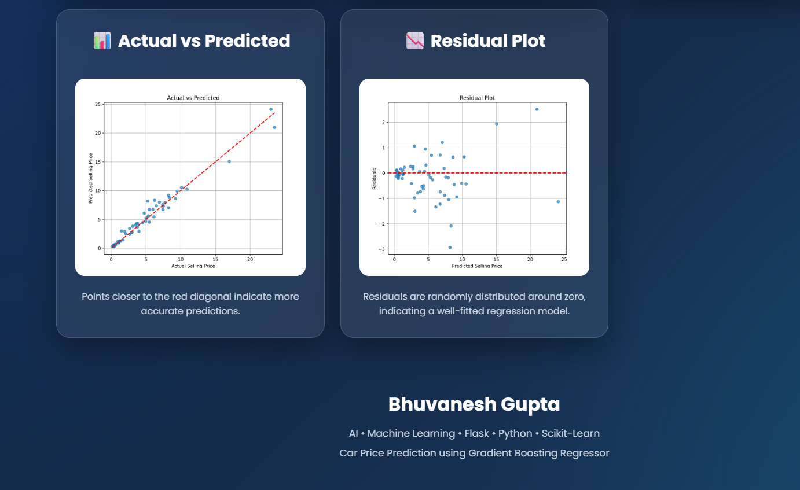

# 🚗 Car Price Prediction using Machine Learning


---

# 📌 Project Overview

The **Car Price Prediction** project is a Machine Learning web application that predicts the **selling price of a used car** based on its specifications.

The project uses a **Gradient Boosting Regressor**, trained on historical car data, and is deployed using **Flask** with an interactive and responsive web interface.

---

# ✨ Features

- 🚗 Predict Used Car Prices
- 📊 Gradient Boosting Regression Model
- 📈 Feature Importance Visualization
- 📉 Actual vs Predicted Analysis
- 📌 Residual Error Analysis
- 🌐 Responsive Flask Web Application
- ⚡ Instant Price Prediction
- 🎨 Modern User Interface

---

# 🛠 Technologies Used

| Category | Technology |
|----------|------------|
| Programming Language | Python |
| Machine Learning | Scikit-Learn |
| Model | Gradient Boosting Regressor |
| Backend | Flask |
| Frontend | HTML, CSS |
| Data Analysis | Pandas, NumPy |
| Visualization | Matplotlib |
| Model Saving | Joblib |

---

# 📂 Project Structure

```text
Task-2
│
├── screenshots/
│
├── static/
│   ├── actual_vs_predicted.png
│   ├── residual_plot.png
│   ├── style.css
│   └── ...
│
├── templates/
│   └── index.html
│
├── app.py
├── train.py
├── model.py
├── test_model.py
├── car.csv
├── car_price_prediction.pkl
├── requirements.txt
├── README.md
└── .gitignore
```

---

# 🧠 Machine Learning Workflow

```text
Dataset
   │
   ▼
Data Preprocessing
   │
   ▼
Feature Engineering
   │
   ▼
Model Training
   │
   ▼
Gradient Boosting Regressor
   │
   ▼
Model Evaluation
   │
   ▼
Flask Deployment
```

---

# 📊 Dataset

The dataset contains historical information about used cars, including:

- Present Price
- Kilometers Driven
- Fuel Type
- Transmission
- Seller Type
- Number of Previous Owners
- Manufacturing Year

The target variable is:

**Selling Price**

---

# 🤖 Machine Learning Model

Several regression algorithms were evaluated:

- Linear Regression
- Decision Tree Regressor
- Random Forest Regressor
- K-Nearest Neighbors
- **Gradient Boosting Regressor ✅**

The **Gradient Boosting Regressor** achieved the highest prediction accuracy and was selected for deployment.

---

# 📈 Model Performance

| Metric | Value |
|---------|--------|
| R² Score | **0.9694** |
| Mean Absolute Error (MAE) | **0.5607** |
| Root Mean Square Error (RMSE) | **0.8394** |
| Dataset Size | **301 Cars** |

---

# 📊 Feature Importance

The trained model identified the following important features:

- Present Price
- Car Age
- Kilometers Driven
- Fuel Type
- Transmission
- Seller Type
- Owner

The web application also visualizes feature importance dynamically.

---

# 📷 Screenshots

## 🏠 Home Page


---

## 🚗 Prediction Interface

Enter the car details such as present price, kilometers driven, fuel type, seller type, transmission, owner count, and car age.



---

## 💰 Prediction Result

The trained Gradient Boosting model predicts the estimated resale value of the car instantly.



---

## 📊 Model Information & Feature Importance

View the machine learning model details, dataset information, and the importance of each feature used during prediction.



---

## 📈 Model Evaluation

The project includes Actual vs Predicted and Residual Plot visualizations to evaluate model performance.


# ⚙ Installation

## 1️⃣ Clone Repository

```bash
git clone https://github.com/B2906/ShadowFox.git
```

## 2️⃣ Navigate to Task-2

```bash
cd ShadowFox/Task-2
```

## 3️⃣ Create Virtual Environment

```bash
python -m venv venv
```

## 4️⃣ Activate Environment

### Windows

```bash
venv\Scripts\activate
```

---

## 5️⃣ Install Dependencies

```bash
pip install -r requirements.txt
```

---

## 6️⃣ Run Flask Application

```bash
python app.py
```

---

## 7️⃣ Open Browser

```text
http://127.0.0.1:5000
```

---

# 🚀 How It Works

```text
User Inputs
     │
     ▼
Data Preprocessing
     │
     ▼
Feature Encoding
     │
     ▼
Gradient Boosting Model
     │
     ▼
Price Prediction
     │
     ▼
Prediction Display
```

---

# 🔮 Future Enhancements

- 🌍 Live Market Price Integration
- 📱 Mobile Responsive Dashboard
- ☁ Cloud Deployment
- 🤖 Deep Learning-Based Prediction
- 📊 More Advanced Analytics
- 📈 Explainable AI (SHAP)

---

# 👨‍💻 Developer

**Bhuvanesh Gupta**

Machine Learning & Artificial Intelligence Enthusiast

**GitHub**

https://github.com/B2906

---

# 📜 License

This project was developed as part of the **ShadowFox Machine Learning Internship** for educational purposes.
